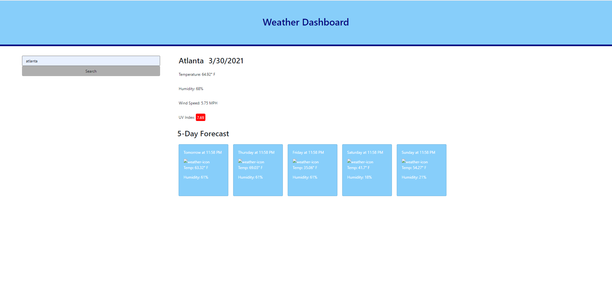

# 06 Server-Side APIs: Weather Dashboard

## Description
First starting off with a hardcoded wireframe of the weather dashboard. 
Second worked on the Search form to retrieve data from Weather api.
Third worked on the current weather in a city section by accessing different keys of the array of objects and query parameters. Got it to console.log successfully and need to get it to appear on the page next.

## Screenshot

[Deployed Site](https://greenkimparsons.github.io/weather-dashboard/)
